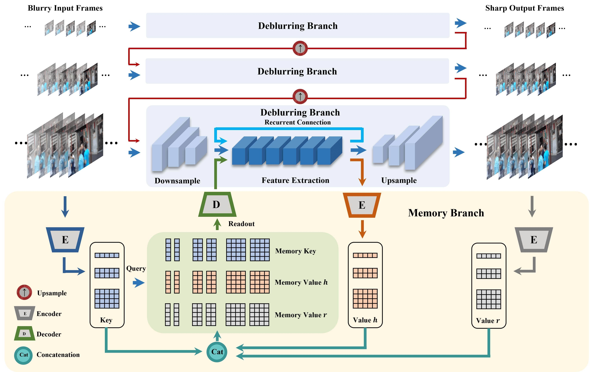

# Multi-Scale Memory-Based Video Deblurring

This repository is the Pytorch implementation of [Multi-Scale Memory-Based Video Deblurring](https://arxiv.org/abs/2204.02977), appearing in CVPR 2022.



## Prerequisites

- Python 3.7
- PyTorch 1.9.1
- Torchvision 0.10.1
- pyyaml
- opencv-python
- tensorboard
- tqdm
- lmdb
- scikit-image
- thop
- matplotlib

## Checkpoints and Dataset
Please download the checkpoints and dataset from [Google Drive](https://drive.google.com/drive/folders/1rd9bIvsk9DBZaA7LXWGNMZ3SM11-_g8h?usp=sharing).

Inference result on the datasets are also avaliable in the above link.

Our codes use lmdb format. If you would like to use other datasets, please convert them into lmdb format. The details can be found [here](https://github.com/zzh-tech/ESTRNN/blob/master/data/how_to_make_dataset_file.ipynb).

In our CVPR version, the reported GMACs includes a redundant operation. We removed this operation, so the actual GMACs is 325.48.

## Training
To train the model on the downsampled GOPRO dataset, run the below command:
```
python main.py --config config/memdeblur_gopro_ds.yml
```

To train the model on the original GOPRO dataset, run the below command:
```
python main.py --config config/memdeblur_gopro_ori.yml
```


## Evaluation
To evaluate the model on the downsampled GOPRO dataset, please **turn on the `test_only` option in the config file** and run the below command:
```
python main.py --config config/memdeblur_gopro_ds.yml
```

To evaluate the model on the original GOPRO dataset, please **turn on the `test_only` option in the config file** and run the below command:
```
python main.py --config config/memdeblur_gopro_ori.yml
```

As mentioned in Section 4.1, we reduce the memory size by discarding old memories. This feature is automatically turned on as indicated by `test_mem_length: 5 ` in the config file. To turn this feature off and utilize the full memory, please set it to `None`, i.e., `test_mem_length: ~ `.


## TODO
We plan to update the evaluation results on DVD dataset in the near future.


## Credits
Our codes are modified from [ESTRNN](https://github.com/zzh-tech/ESTRNN) and [mmediting](https://github.com/open-mmlab/mmediting). We thank for their excellent work!